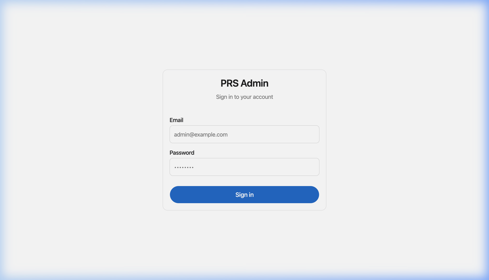
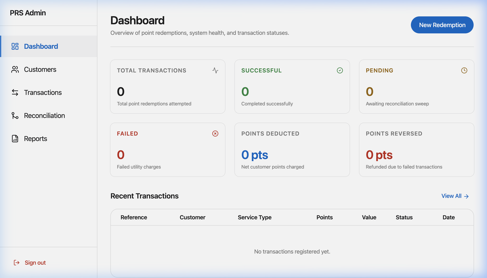
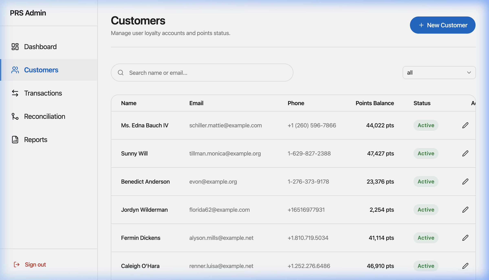
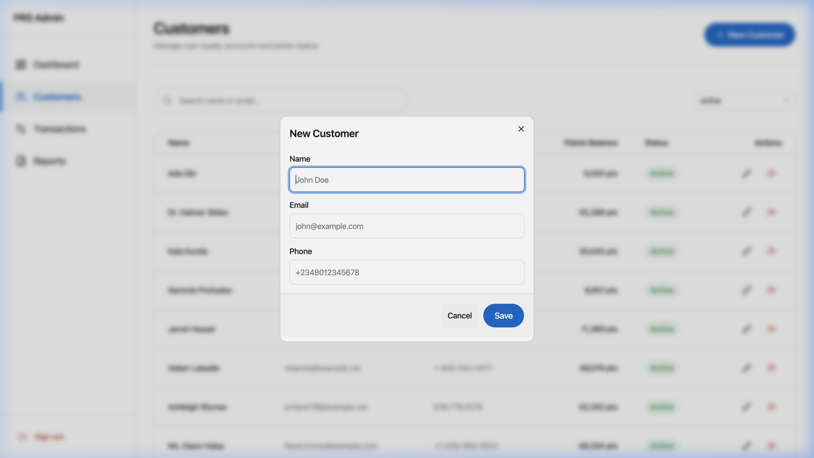
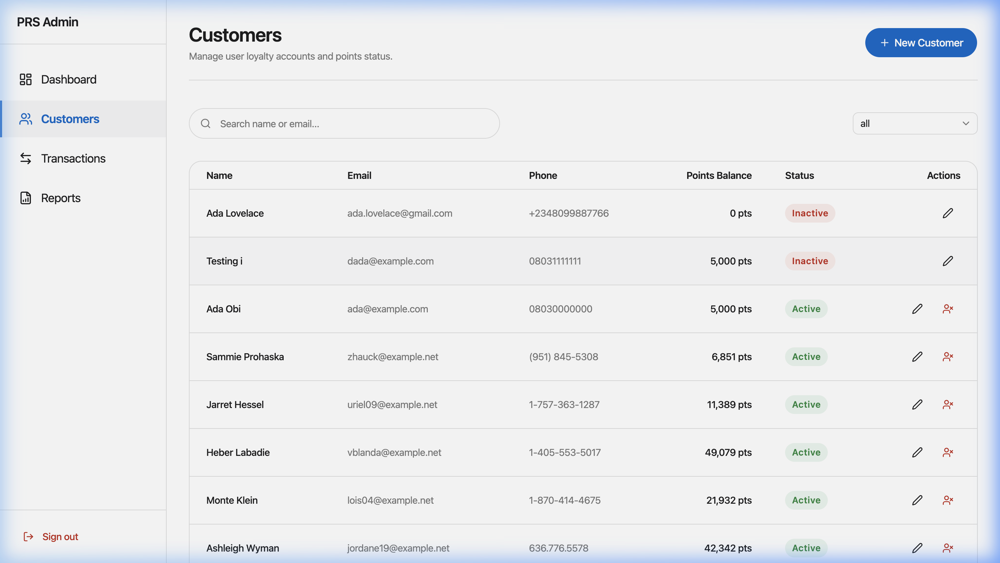
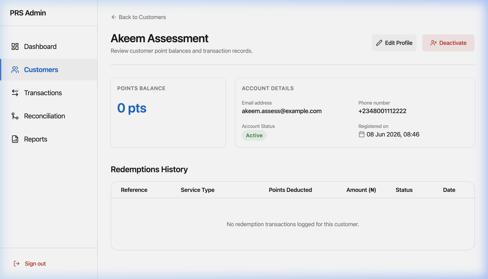
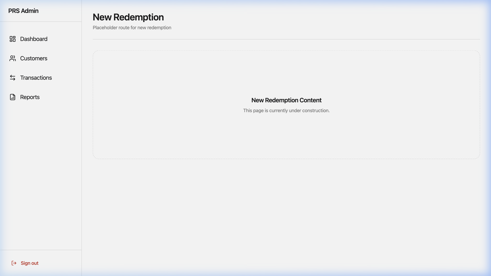
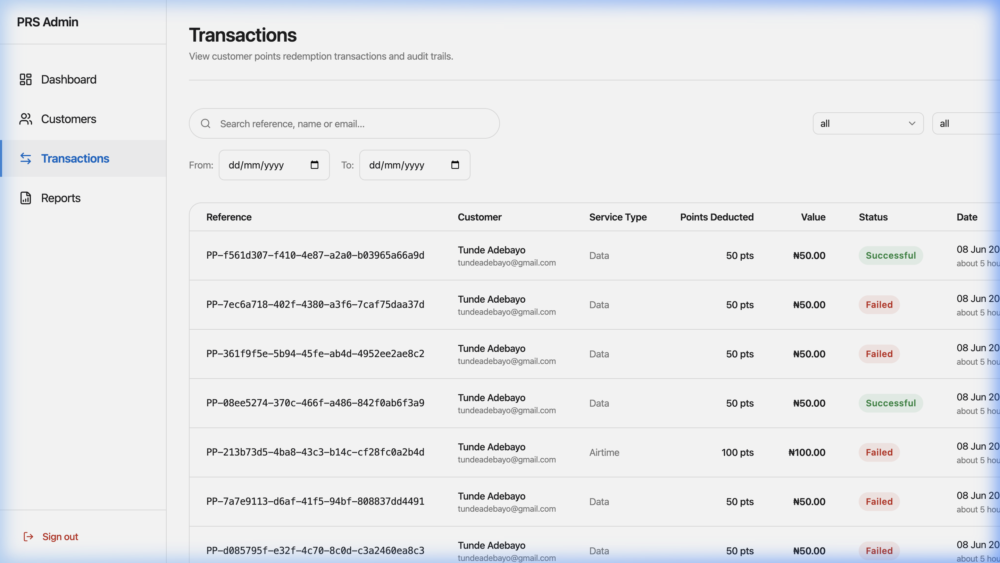
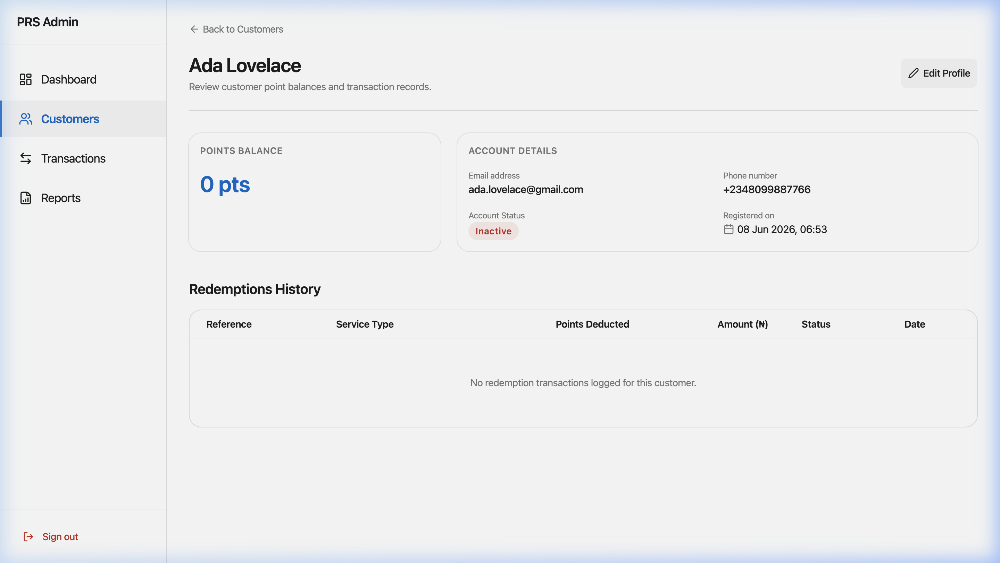
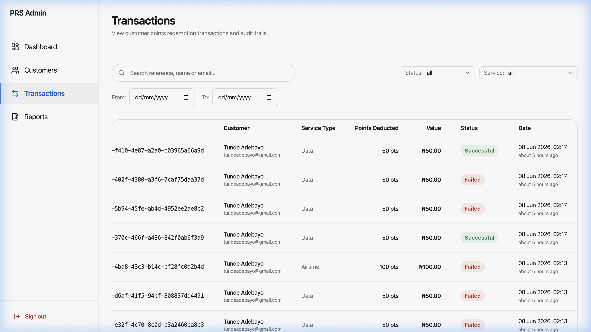

# Points Redemption & Reconciliation System — Visual Guide

This visual guide provides screenshots and walks through the core features of the loyalty points management system. All screenshots are available under [`docs/screenshots/`](file:///Users/mac/Projects/points-redemption/docs/screenshots).

---

## 1. Authentication
Secure access is required for administrative actions. The dashboard features a clean, unified sign-in interface utilizing Laravel Sanctum for API token validation and state management.

- **Path:** [`docs/screenshots/01_login.png`](file:///Users/mac/Projects/points-redemption/docs/screenshots/01_login.png)
- **Features:** Password hashing, rate limiting protection against brute-force logins, and validation indicators.

---

## 2. Metrics & Dashboard
The central dashboard provides the administrative team with high-level aggregates and recent activity at a glance.

- **Path:** [`docs/screenshots/02_dashboard.png`](file:///Users/mac/Projects/points-redemption/docs/screenshots/02_dashboard.png)
- **Features:**
  - Dynamic KPI cards displaying:
    - **Total Attempted Transactions**
    - **Successful Redemptions**
    - **Pending (Requery Queue)**
    - **Failed (Declined/Timeout)**
    - **Total Points Deducted**
    - **Total Points Reversed**
  - **Recent Activity Table**: Real-time listing of the latest redemptions with quick links to transaction details.
  - Sidebar navigation offering seamless routing with responsive layout wrappers.

---

## 3. Customer Directory & Actions
Manage the customer database, view point balances, and control active status.

*(Note: Refer to [`docs/screenshots/03_customers_list.png`](file:///Users/mac/Projects/points-redemption/docs/screenshots/03_customers_list.png) for the list view.)*

### 3.1. Add New Customer
Create customers easily using the Zod-validated input modal.

- **Path:** [`docs/screenshots/08_new_customer_modal.png`](file:///Users/mac/Projects/points-redemption/docs/screenshots/08_new_customer_modal.png)
- **Features:** Standard inputs for customer name, email, phone number, and opening points balance.

### 3.2. Deactivated / Inactive Customers
Deactivated customers are clearly flagged and cannot perform points redemptions.

- **Path:** [`docs/screenshots/09_deactivated_customers.png`](file:///Users/mac/Projects/points-redemption/docs/screenshots/09_deactivated_customers.png)
- **Features:** Unified toggle switch for instant activation/deactivation, updating status immediately via PATCH API.

---

## 4. Customer Detailed File
Provides an individual profile dossier for analyzing a customer's history and balances.

- **Path:** [`docs/screenshots/04_customer_details.png`](file:///Users/mac/Projects/points-redemption/docs/screenshots/04_customer_details.png)
- **Features:**
  - High-level cards for Current Points, Total Redeemed, and Status.
  - Filterable transaction history showing only redemptions initiated by this customer.
  - Direct quick link to start a new points redemption for this customer.

---

## 5. New Points Redemption Form
Handles point conversions to actual bill payments (airtime, data, utilities) securely.

- **Path:** [`docs/screenshots/05_new_redemption.png`](file:///Users/mac/Projects/points-redemption/docs/screenshots/05_new_redemption.png)
- **Features:**
  - **Auto cost calculation:** Cost in points updates dynamically as the user enters the bill amount.
  - **Balance validation:** Ensures customer points are sufficient before permitting submission.
  - **Idempotency protection:** Standard UUID key attached to submit requests, protecting against duplicate clicks or connection retries.

---

## 6. Transactions Search & Filters
A powerful reporting panel for filtering and exploring redemptions.

- **Path:** [`docs/screenshots/06_transactions_list.png`](file:///Users/mac/Projects/points-redemption/docs/screenshots/06_transactions_list.png)
- **Features:**
  - Unified search box (filters by customer name, email, and reference code).
  - Explicit labels on filters (`Status: All`, `Service: Data Bundle`) for readability.
  - Interactive table with clear columns, status badges, and details triggers.
  - Contains table horizontal scrollbar inside the card component boundaries (preventing page-wide layout breaks).

---

## 7. Transaction Audit Trail & Manual Reconciliation
Displays complete history, payment metadata, and an chronological timeline of state transitions.

- **Path:** [`docs/screenshots/07_transaction_details.png`](file:///Users/mac/Projects/points-redemption/docs/screenshots/07_transaction_details.png)
- **Features:**
  - Detailed metadata including amount, equivalent cost in points, provider response, and unique references.
  - **Chronological Timeline**: Step-by-step audit logs showing exact state transitions (e.g., `pending` to `successful`).
  - **Manual Reconciliation Trigger**: For pending transactions, displays a "Run Reconciliation" button to query the Bills & Payments provider and resolve the status immediately.

---

## 8. Filtered Transactions (Filtered View)
Quick and easy status isolation for auditing.

- **Path:** [`docs/screenshots/10_filtered_transactions.png`](file:///Users/mac/Projects/points-redemption/docs/screenshots/10_filtered_transactions.png)
- **Features:** Filters data in real-time, matching status badges dynamically (e.g., displaying only green-themed "Successful" states).
